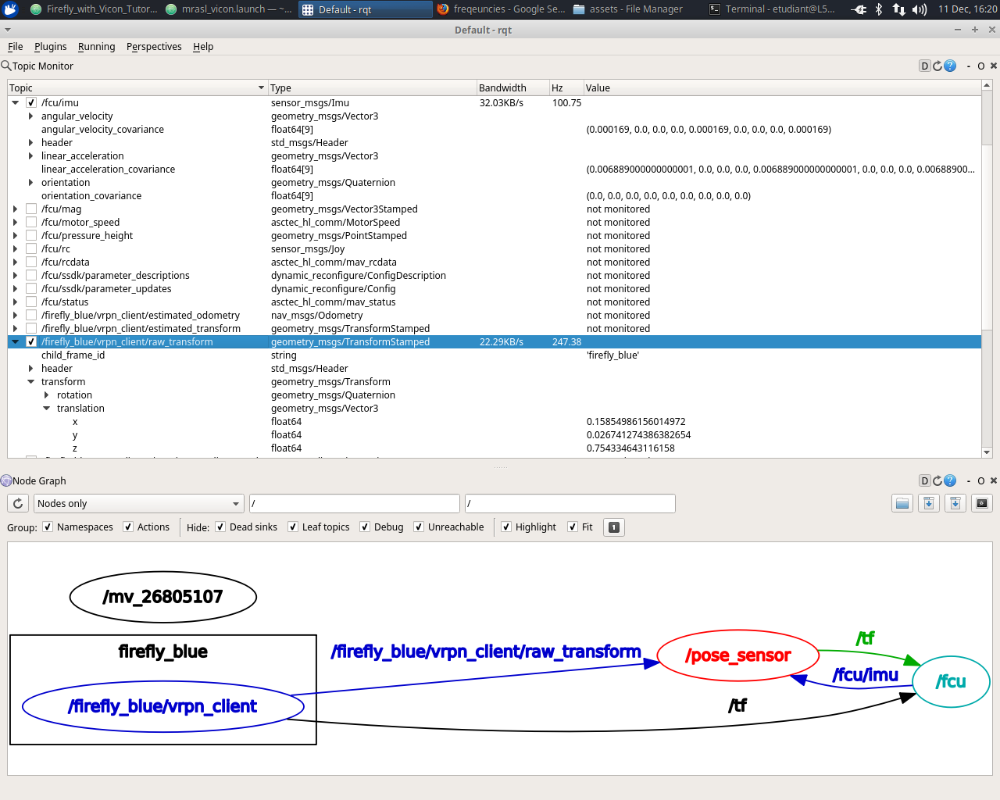
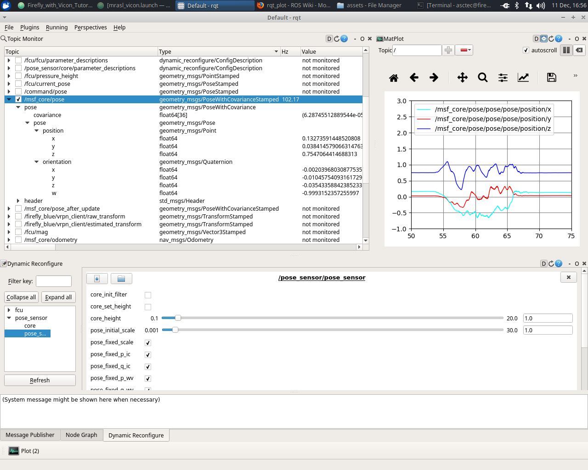

# MSF filter

## Check MSF node

You must finish the [pre-setup](firefly_setup.md) task.

Open a `rqt` GUI in a remote computer terminal by typing `$ rqt`and verify running nodes

* Menu `Plugins/Topics/Topic Monitor`: check filter input/output data
  * Filter input from Vicon: topic `/firefly_blue/vrpn_client/raw_transform`, 250Hz
  * Filter input from Firefly: topic `/fcu/imu`, 100Hz
  * Filter output: `msf_core/pose` or `msf_core/odometry`, 100Hz
* Menu `Plugins/Visualization/Plot`: plot the position, velocity, etc
* Menu `Plugins/Introspection/Node Graph`

## **Init the filter**

* Menu `Plugins/Configuration/Dynamic Reconfigure`
  * `fcu/fcu`: chose `POSCTRL_OFF` for `position_control` and `STATE_EST_OFF` for `state_estimation`
  * `pose_sensor/pose_sensor`: click on `core_init_filter`
* Move the drone and check

After init the filter, the `/pose_sensor` node has to show a message \(OBC terminal\) as: `initial measurement pos:[ 0.158259 0.0267092 0.754158] orientation: [0.998, 0.00129, 0.025, 0.0552]` and some other messages.

