# Calibration

## Important note


Always **recalibrate** the Vicon system _every day_ _before starting to work_ or when _something went wrong_ !


## Connection

1. [ ] Power on the Vicon PC and launch the _Vicon Tracker 3.4_ application
2. [ ] Choose the _3D Perspective_ view in the drop-down list and make sure that all the cameras are connected \(green\).

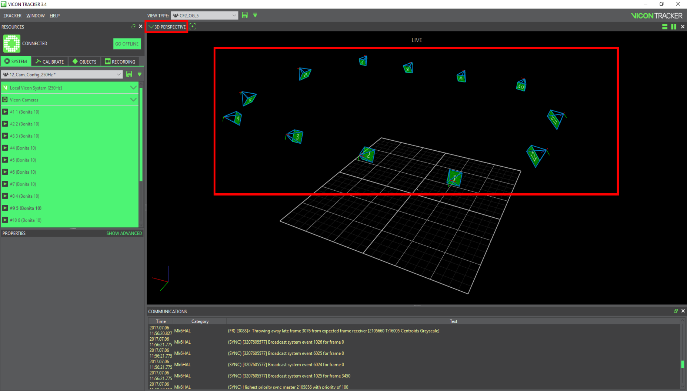

## Camera masks

* [ ] Navigate to and select `SYSTEM > 12_Cam_Config_Cal` 

![\[100Hz\] to obtain better calibration performances](../.gitbook/assets/vicon_mask0.png)

1. [ ] Navigate to and select `CALIBRATE > CREATE CAMERA MASKS > START`

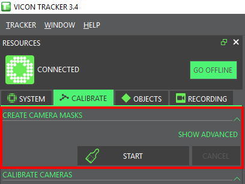

* [ ] Wait a few seconds until all the reflective spots in the flight area become blue \(they are initially white\) and click on _STOP_ 

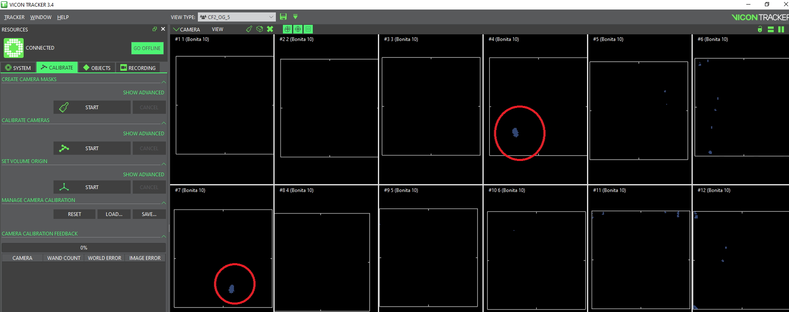


All the blue spots do no longer belong to the 3D space being monitored by the Vicon system.  Make sure that your vehicle will not operate in these _dead_ areas.


## **Calibration**

1. [ ] Navigate to and select `CALIBRATE > CALIBRATE CAMERAS > START`

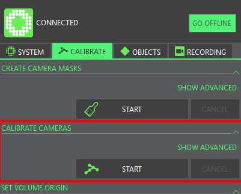

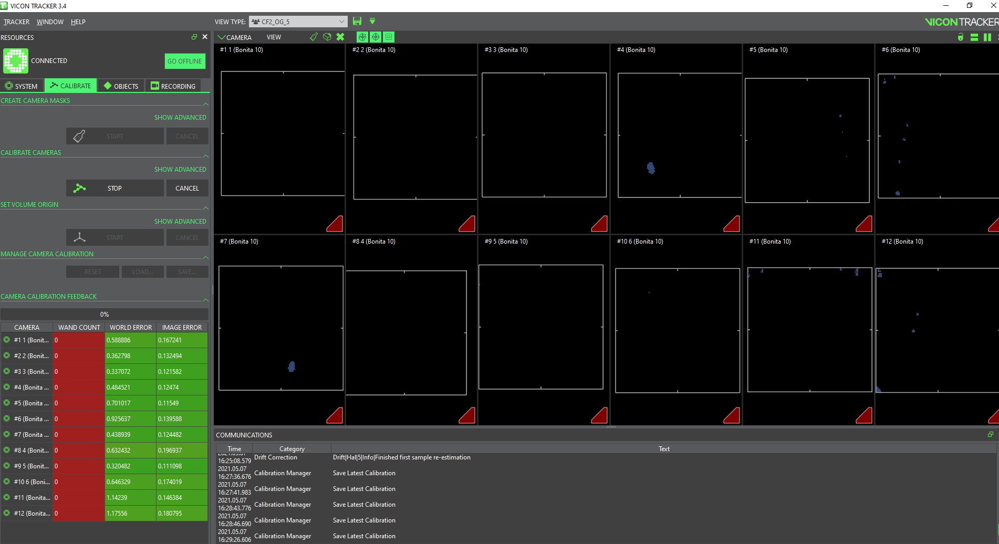

1. [ ] Power on the Active Wand and make sure that the 5 lights turn on \(otherwise, you must charge the wand\)

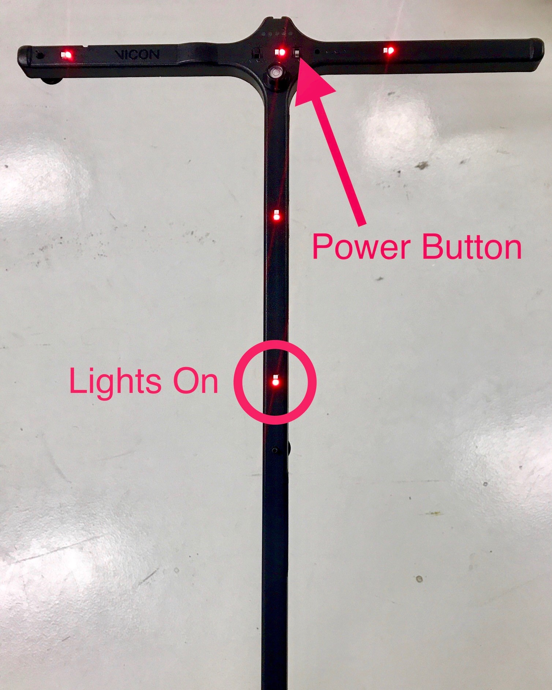

1. [ ] Use the Active Wand to calibrate the Vicon system: walk in front of all the cameras and make sure that the wand is always visible by at least two cameras



* [ ] When a camera reaches 2000 wand counts

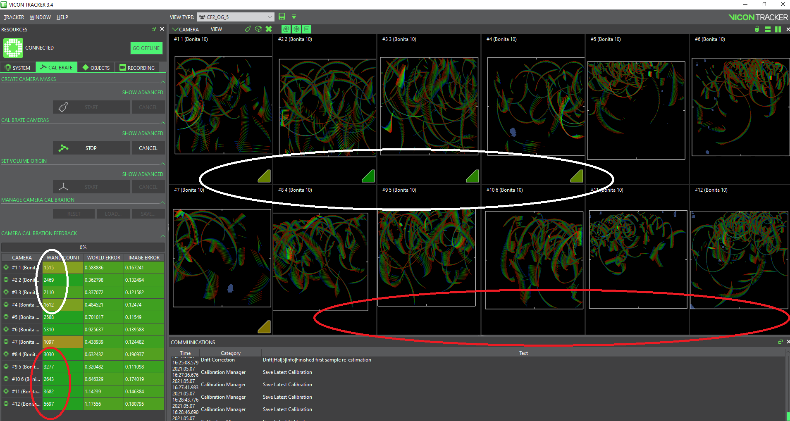

* [ ] When all cameras reach 2000 wand counts, the calibration process automatically stops and the program goes into the final calculation process.

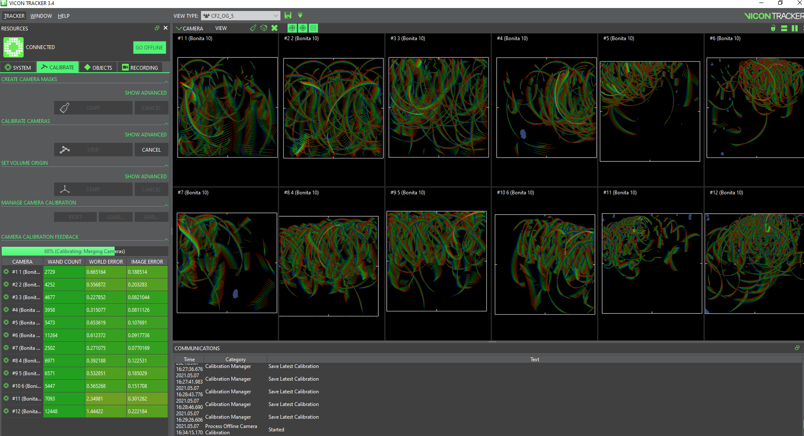

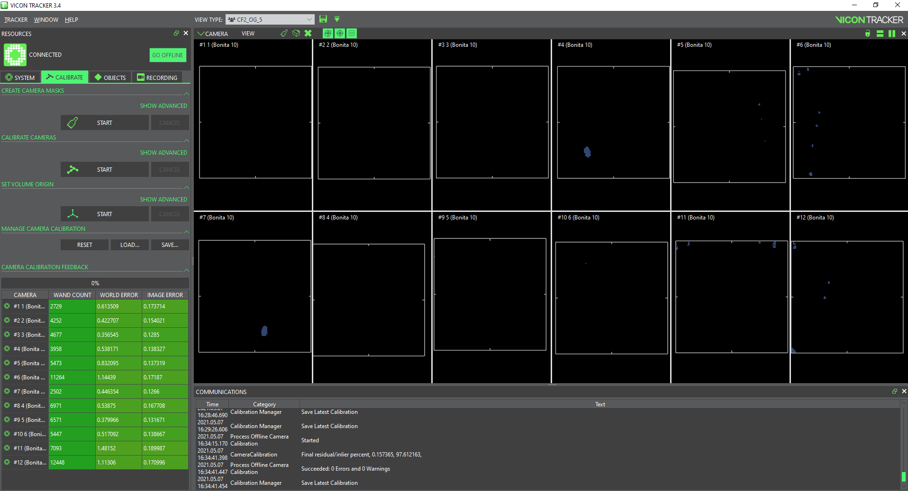

## Set the volume origin

* [ ] Place the Active Wand at the desired origin, turn it on

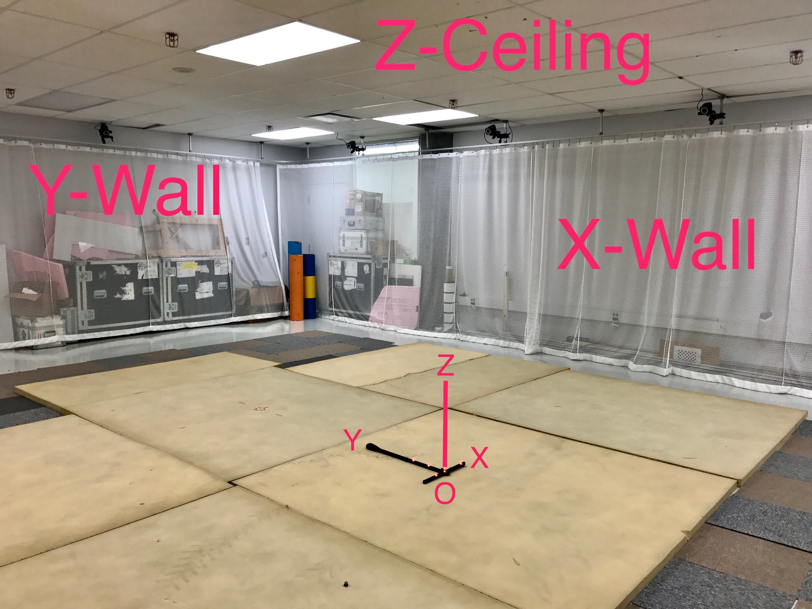

* [ ] Navigate to and select `CALIBRATE > SET VOLUME ORIGIN > START`, wait a few seconds and click on _STOP_

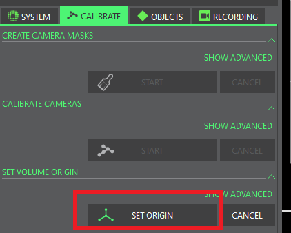

## Vicon data sampling frequency

The default sampling frequency is 100Hz. You can change the requested frame rate up to 250Hz.

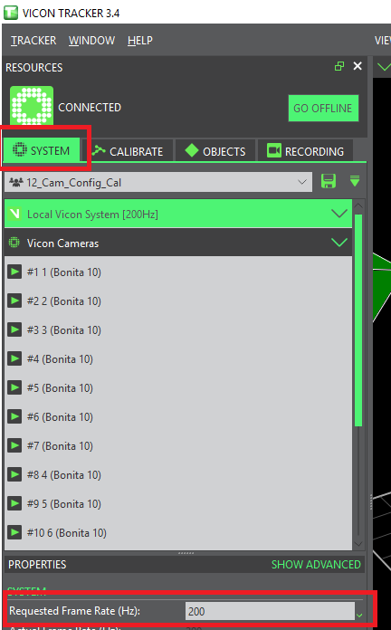

The Vicon system is now ready to be used.

## 

