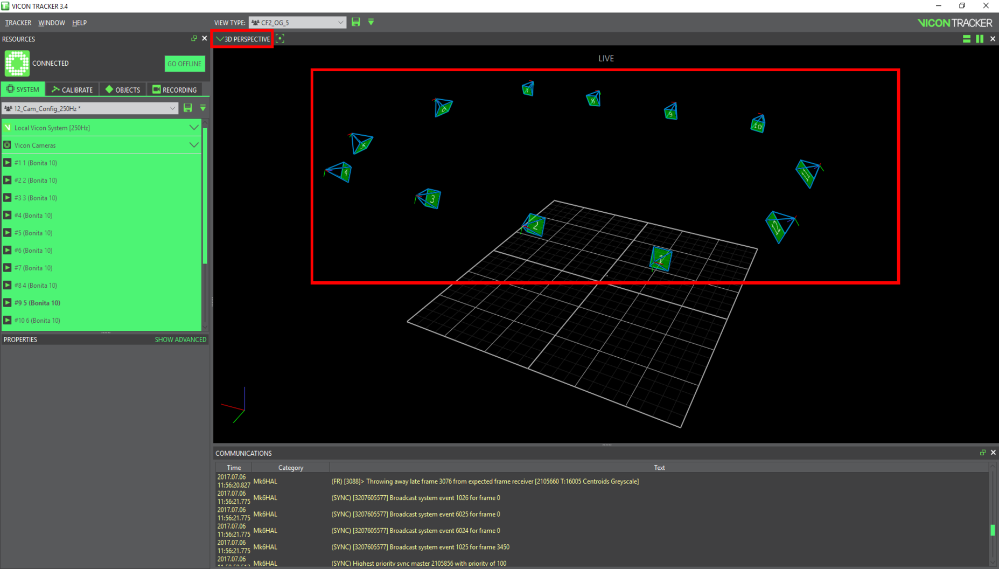

# Calibration



#### Always **recalibrate** the Vicon system _every day_ before starting to work!


### Vicon Tracker 3.4

On the Vicon server \(Windows\), launch the _Vicon Tracker_ application and make sure that all the cameras are connected \(green\).



### Calibration

Use the Active Wand to calibrate the Vicon system as in the current [Vicon Tracker User Guide](https://docs.Vicon.com/display/Tracker34/Tracker+documentation)

Vicon calibration Calibration Vicon Active Wand

### Set the volume origin

Place the Active Wand at the desired origin and set it in Vicon Tracker

Set the volume origin

### Vicon data sampling frequency

The default sampling frequency is 100Hz. You can change the requested frame rate up to 250Hz.

Sampling frequency

The Vicon system is now ready to be used.

## Create a Vicon object

### Vicon marker placement

Place at least three [markers](https://www.vicon.com/products/vicon-devices/markers-and-suits) on the object that you want to track.

Example of Vicon marker placement for 2D object. Why is the second marker placement \(4 markers\) not good? Answer: Due to symetrical structure, Vicon can not distinguish the head and the tail of the object. The position is always good but the heading angle can be deviated by 180 deg. Good placement of markers Bad placement of markers

### Create a Vicon object

Select the markers that define the object and click `Create` in the Objects tab of the `Vicon Tracker` application \(\).

Creating an object

You can also change the origin and the orientation of the object as documented [here](https://docs.vicon.com/display/Tracker33/About+the+Objects+tab). Vicon uses the standard engineering coordinate system of $x$ axe - forward \(Red\), $y$ axe - right \(Green\), $z$ axe - up \(Blue\).

### Check the Vicon Data

Finally, you can track your object with Vicon and trace its pose as shown in

Tracking an object

## Vicon and ROS <a id="ros-setup status=ready"></a>

### Install ROS interface and dependencies

You can use the ROS interface for [VRPN Client](http://www.cs.unc.edu/Research/vrpn/).

Go to your workspace, clone and build this repo and its dependencies:

```text
laptop $ cd ![your_ws]/src
laptop $ git clone https://github.com/MRASL/ros_vrpn_client
laptop $ git clone https://github.com/ethz-asl/vrpn_catkin
laptop $ git clone https://github.com/catkin/catkin_simple.git
laptop $ git clone https://github.com/ethz-asl/glog_catkin.git
laptop $ cd .. & catkin build
```

### Publishing Vicon data to the ROS Network

Run the node `vrpn_client` using the launch file `mrasl_vicon_duckiebot`

```text
laptop $ roslaunch ros_vrpn_client mrasl_vicon_duckiebot.launch object_name:=![vicon_object_name]
```

This launch file is a copy of the original `asl_vicon.launch`, using for the object `vicon_object_name` and the Vicon server IP 192.168.1.200.

Using `rostopic list`, you can see the following topics from Vicon:

```text
/duckiebot_razor/vrpn_client/estimated_odometry                                                      /duckiebot_razor/vrpn_client/estimated_transform                                                     
/duckiebot_razor/vrpn_client/raw_transform                                                           
/duckiebot_razor/vrpn_client/vicon_intermediate_results                                              
/rosout                                                                                               
/rosout_agg
```

