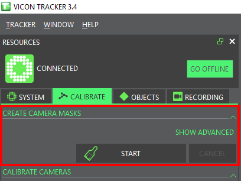
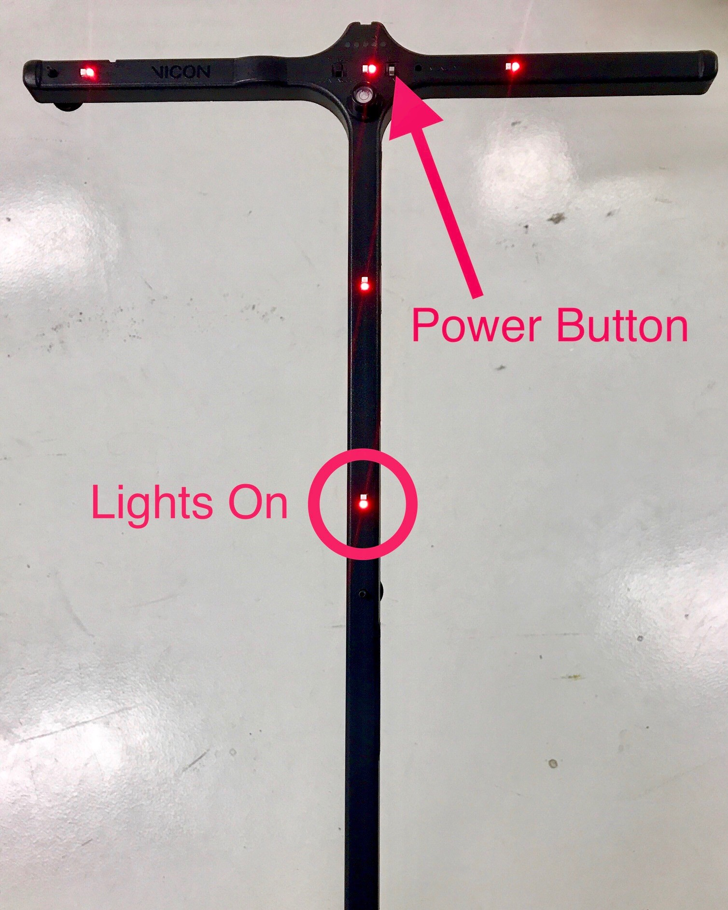

# Calibration

## Important note


Always **recalibrate** the Vicon system _every day_ _before starting to work_ or when _something went wrong_ !


## Connection

1. [ ] Power on the Vicon PC and launch the _Vicon Tracker 3.4_ application
2. [ ] Choose the _3D Perspective_ view in the drop-down list and make sure that all the cameras are connected \(green\).


## Camera masks

* [ ] Navigate to and select `SYSTEM > 12_Cam_Config_Cal` 

![\[100Hz\] to obtain better calibration performances](../../.gitbook/assets/vicon_mask0.png)

1. [ ] Navigate to and select `CALIBRATE > CREATE CAMERA MASKS > START`



* [ ] Wait a few seconds until all the reflective spots in the flight area become blue \(they are initially white\) and click on _STOP_ 



All the blue spots do no longer belong to the 3D space being monitored by the Vicon system.  Make sure that your vehicle will not operate in these _dead_ areas.


## **Calibration**

1. [ ] Navigate to and select `CALIBRATE > CALIBRATE CAMERAS > START`


1. [ ] Power on the Active Wand and make sure that the 5 lights turn on \(otherwise, you must charge the wand\)



1. [ ] Use the Active Wand to calibrate the Vicon system: walk in front of all the cameras and make sure that the wand is always visible by at least two cameras



* [ ] When every camera reaches 2000 wand counts, the calibration process automatically stops and the program goes into the final calculation process.


## Set the volume origin

Place the Active Wand at the desired origin and set it in Vicon Tracker

Set the volume origin

### Vicon data sampling frequency

The default sampling frequency is 100Hz. You can change the requested frame rate up to 250Hz.

Sampling frequency

The Vicon system is now ready to be used.

## Create a Vicon object

### Vicon marker placement

Place at least three [markers](https://www.vicon.com/products/vicon-devices/markers-and-suits) on the object that you want to track.

Example of Vicon marker placement for 2D object. Why is the second marker placement \(4 markers\) not good? Answer: Due to symetrical structure, Vicon can not distinguish the head and the tail of the object. The position is always good but the heading angle can be deviated by 180 deg. Good placement of markers Bad placement of markers

### Create a Vicon object

Select the markers that define the object and click `Create` in the Objects tab of the `Vicon Tracker` application \(\).

Creating an object

You can also change the origin and the orientation of the object as documented [here](https://docs.vicon.com/display/Tracker33/About+the+Objects+tab). Vicon uses the standard engineering coordinate system of $x$ axe - forward \(Red\), $y$ axe - right \(Green\), $z$ axe - up \(Blue\).

### Check the Vicon Data

Finally, you can track your object with Vicon and trace its pose as shown in

Tracking an object

## Vicon and ROS <a id="ros-setup status=ready"></a>

### Install ROS interface and dependencies

You can use the ROS interface for [VRPN Client](http://www.cs.unc.edu/Research/vrpn/).

Go to your workspace, clone and build this repo and its dependencies:

```text
laptop $ cd ![your_ws]/src
laptop $ git clone https://github.com/MRASL/ros_vrpn_client
laptop $ git clone https://github.com/ethz-asl/vrpn_catkin
laptop $ git clone https://github.com/catkin/catkin_simple.git
laptop $ git clone https://github.com/ethz-asl/glog_catkin.git
laptop $ cd .. & catkin build
```

### Publishing Vicon data to the ROS Network

Run the node `vrpn_client` using the launch file `mrasl_vicon_duckiebot`

```text
laptop $ roslaunch ros_vrpn_client mrasl_vicon_duckiebot.launch object_name:=![vicon_object_name]
```

This launch file is a copy of the original `asl_vicon.launch`, using for the object `vicon_object_name` and the Vicon server IP 192.168.1.200.

Using `rostopic list`, you can see the following topics from Vicon:

```text
/duckiebot_razor/vrpn_client/estimated_odometry                                                      /duckiebot_razor/vrpn_client/estimated_transform                                                     
/duckiebot_razor/vrpn_client/raw_transform                                                           
/duckiebot_razor/vrpn_client/vicon_intermediate_results                                              
/rosout                                                                                               
/rosout_agg
```

