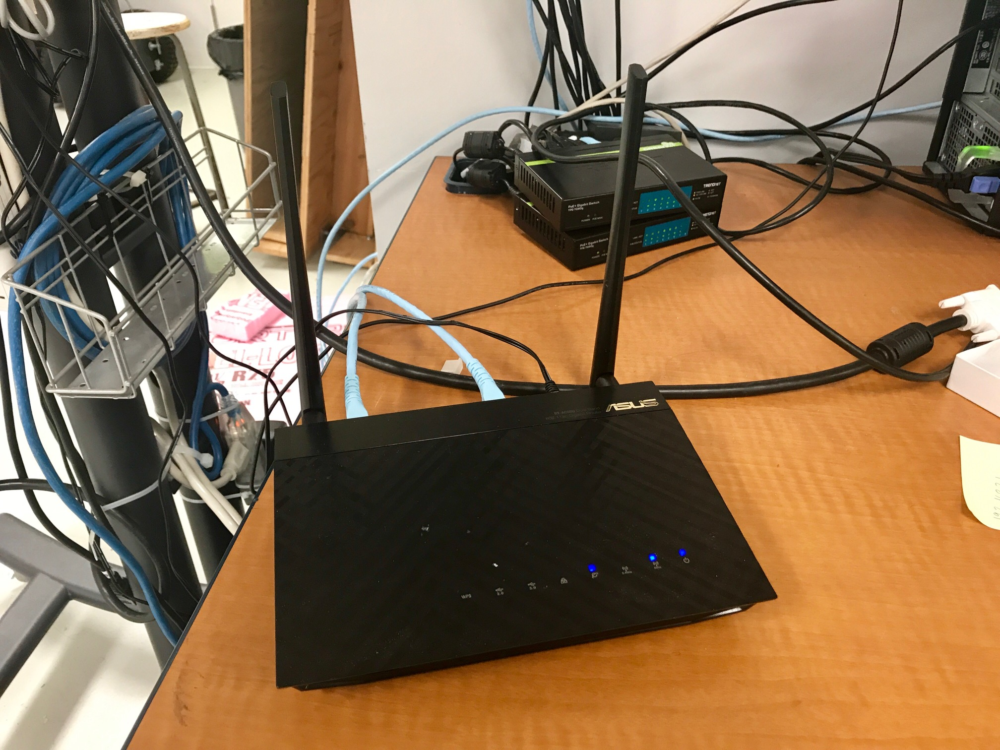
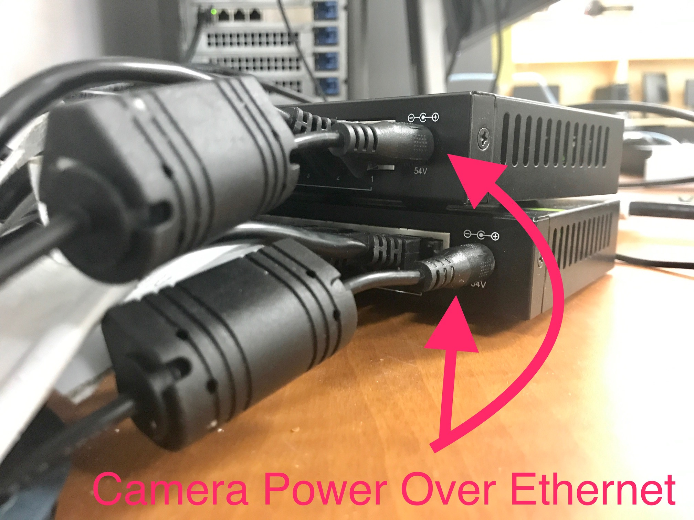

# Pre-setup

## Is the floor well covered?

## Power on

1. [ ] Asus router \([WiFi network MRASL](https://mrasl.gitbooks.io/documentation/content/Equipment/Networking/LAN.html)\)

* [ ] Netgear switch \(for 2 TP-Link Wireless Access Points\)

* [ ] 2 Trendnet switches \(Vicon cameras\)


**Power off** after work!


