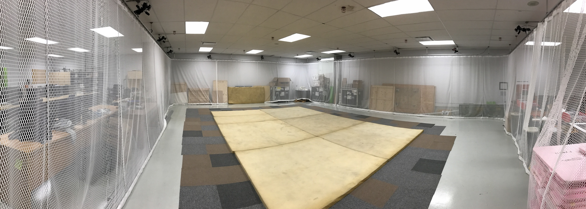
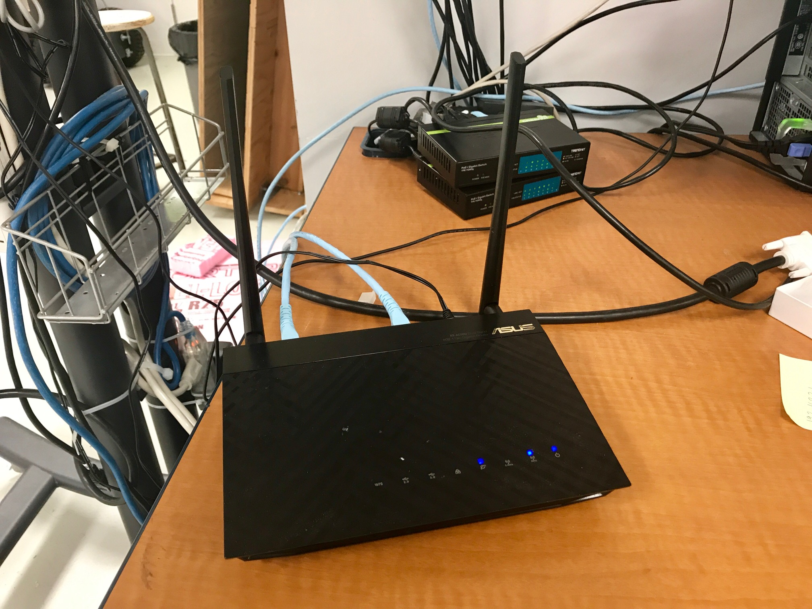
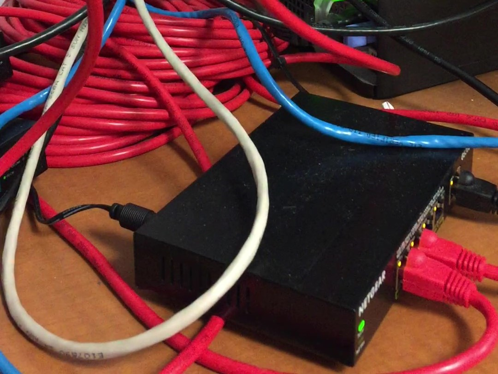
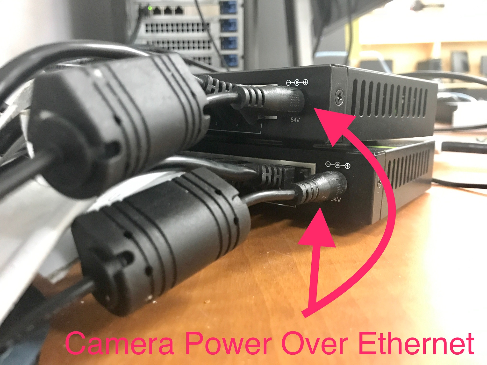

# Setup

## Is the floor well covered?

## Power on

1. [ ] Asus router \(WiFi network MRASL\)

* [ ] Netgear switch \(for 2 TP-Link Wireless Access Points\)

* [ ] 2 Trendnet switches \(Vicon cameras\)


**Power off** after work!


