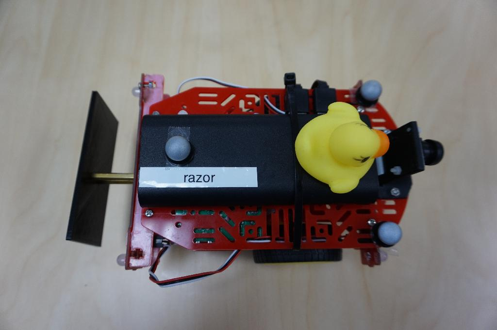
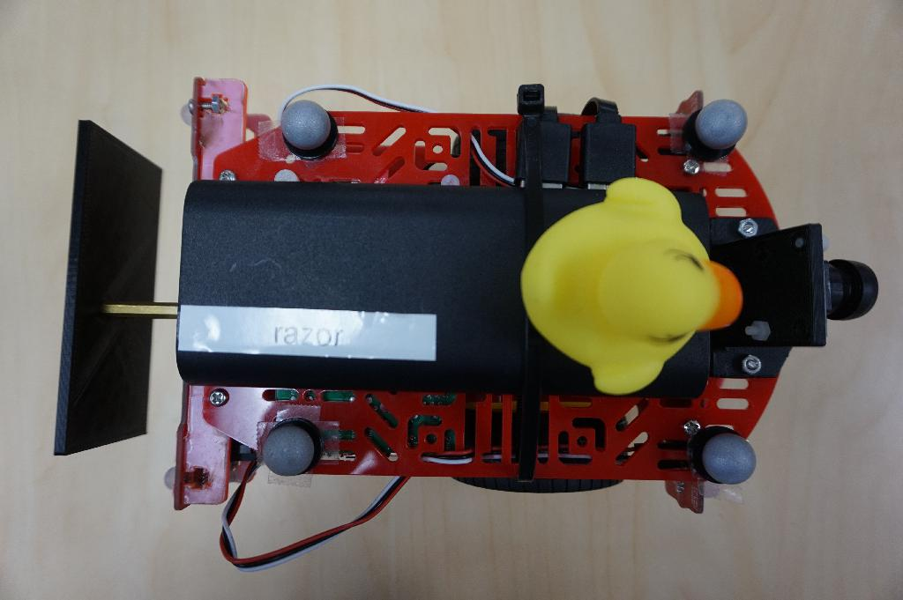
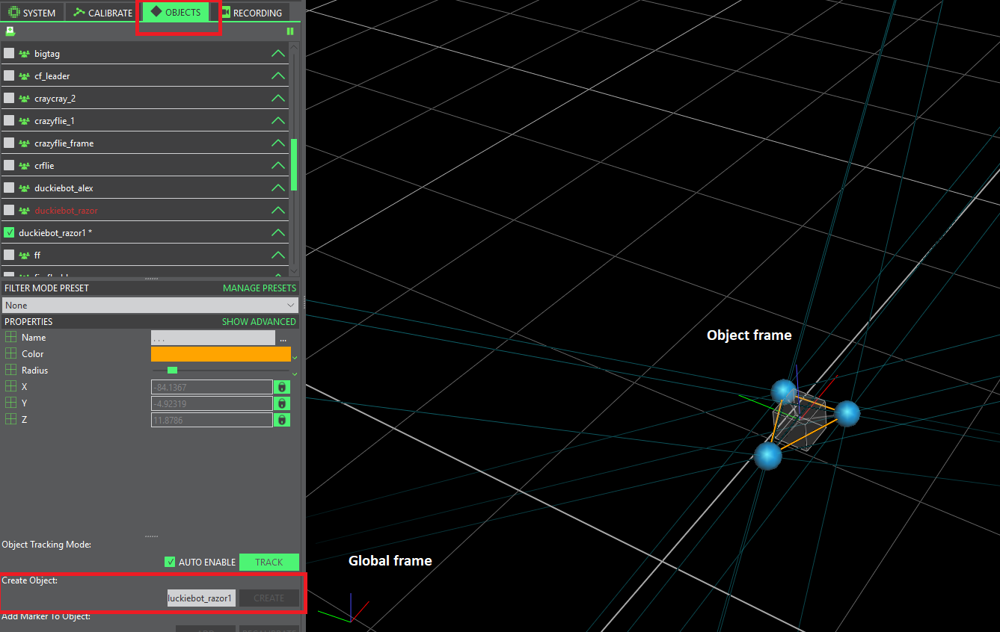
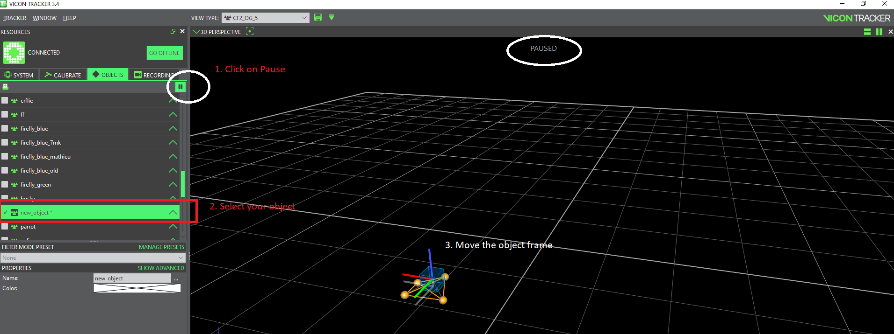
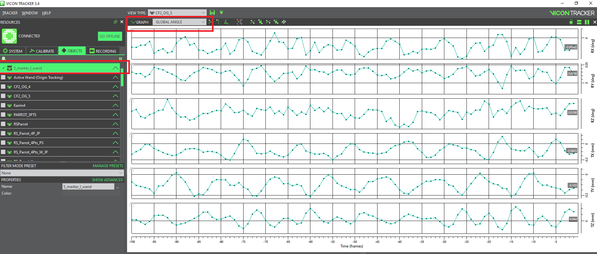

# Vicon object

## Vicon marker placement

Place at least three [markers](https://www.vicon.com/products/vicon-devices/markers-and-suits) on the object that you want to track.






Why is the second marker placement \(4 markers\) not good? Answer: Due to symmetrical structure, Vicon can not distinguish the head and the tail of the object. The position is always good but the heading angle can be deviated by 180 deg.


## Create a Vicon object

* [ ] Place your robot \(with markers\) in the survey area
* [ ] Hold down the `Ctrl` key to select the markers that define the object and click `Create` in the `OBJECTS`tab.



* [ ] You can also change the origin and the orientation of the object as documented [here](https://docs.vicon.com/display/Tracker33/About+the+Objects+tab). 




Vicon uses the standard engineering coordinate system FLU: $$x$$axis - Forward \(Red\), $$y$$axis - Left \(Green\), $$z$$axis -Up \(Blue\).


## Tracking

Finally, you can track your object with Vicon and trace its pose




## Vicon and ROS <a id="ros-setup status=ready"></a>

### Install ROS interface and dependencies

You can use the ROS interface for [VRPN Client](http://www.cs.unc.edu/Research/vrpn/).

Go to your workspace, clone and build this repo and its dependencies:

```text
laptop $ cd ![your_ws]/src
laptop $ git clone https://github.com/MRASL/ros_vrpn_client
laptop $ git clone https://github.com/ethz-asl/vrpn_catkin
laptop $ git clone https://github.com/catkin/catkin_simple.git
laptop $ git clone https://github.com/ethz-asl/glog_catkin.git
laptop $ cd .. & catkin build
```

### Publishing Vicon data to the ROS Network

Run the node `vrpn_client` using the launch file `mrasl_vicon_duckiebot`

```text
laptop $ roslaunch ros_vrpn_client mrasl_vicon_duckiebot.launch object_name:=![vicon_object_name]
```

This launch file is a copy of the original `asl_vicon.launch`, using for the object `vicon_object_name` and the Vicon server IP 192.168.1.200.

Using `rostopic list`, you can see the following topics from Vicon:

```text
/duckiebot_razor/vrpn_client/estimated_odometry                                                      /duckiebot_razor/vrpn_client/estimated_transform                                                     
/duckiebot_razor/vrpn_client/raw_transform                                                           
/duckiebot_razor/vrpn_client/vicon_intermediate_results                                              
/rosout                                                                                               
/rosout_agg
```

