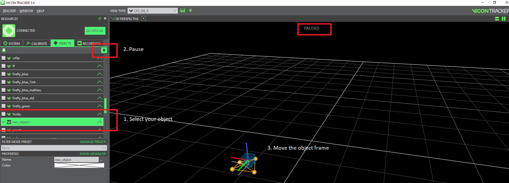

# Vicon object

## Vicon marker placement

Place at least three [markers](https://www.vicon.com/products/vicon-devices/markers-and-suits) on the object that you want to track.


Why is the second marker placement \(4 markers\) not good? 

Answer: Due to symmetrical structure, Vicon can not distinguish the head and the tail of the object. The position is always good but the heading angle can be deviated by 180 deg.


## Create a Vicon object

* [ ] Place your robot \(with markers\) in the survey area
* [ ] Hold down the `Ctrl` key to select the markers that define the object and click `Create` in the `OBJECTS`tab.

* [ ] You can also change the origin and the orientation of the object as documented [here](https://docs.vicon.com/display/Tracker33/About+the+Objects+tab). 


Vicon uses the standard engineering coordinate system FLU: $$x$$axis - Forward \(Red\), $$y$$axis - Left \(Green\), $$z$$axis -Up \(Blue\).


## Tracking

Finally, you can track your object with Vicon and trace its pose

